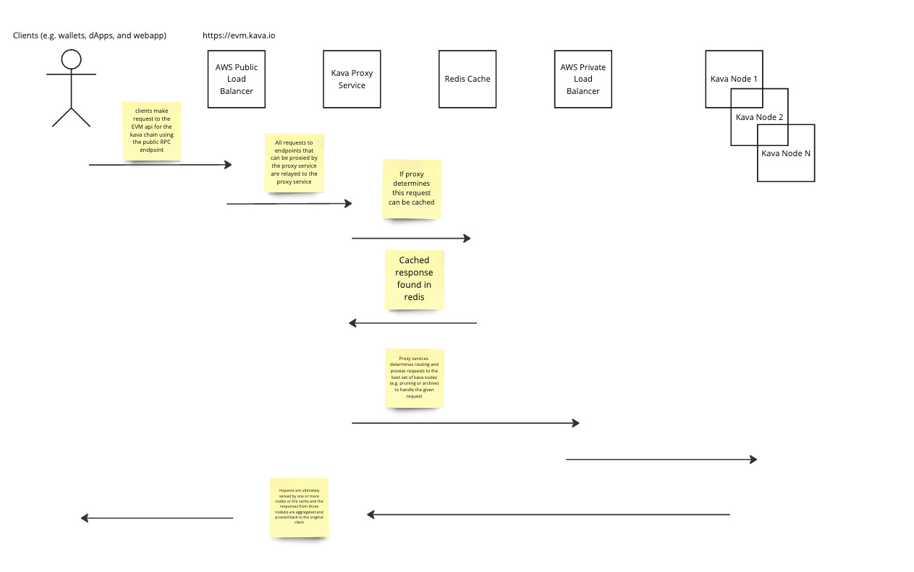
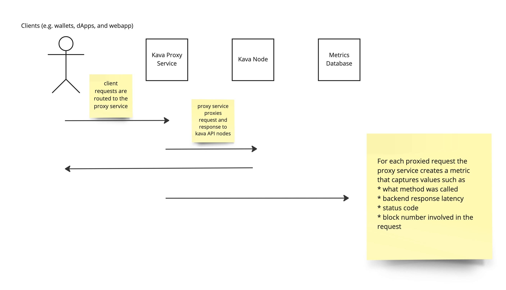

# Proxy Service Architecture

This [directory](./) contains technical documentation and diagrams for developers and operators of the kava proxy service to use while running or developing the service as a reliable, scalable and observable proxy.

## Service Workflows

### Proxy

Clients make requests (e.g. API calls from the [Kava webapp](app.kava.io), other dApps CLIs or scripts) to a public API endpoint URL that maps to a public facing load balancer in AWS. For any request to an API endpoint (such as the Ethereum RPC API) that can be handled by the proxy service, the load balancer will forward the request to an instance of the proxy service.

The default action performed by the proxy service for each request it gets is to proxy the request to the configured URL of a load balanced set of kava blockchain nodes that can best serve the request (e.g. pruning nodes for requests for latest block data or archive node for request to historical block data).

The proxy functionality provides the foundation for all other proxy service features (e.g. logging, caching) by allowing full introspection and transformation of the original request and ultimate response returned to the client.

### API Observability

For every request that is proxied by the proxy service, a [request metric](../decode/evm_rpc.go) is created and stored in a [postgres table](../clients/database/migrations/20230306182203_add_proxied_request_metrics_table.up.sql) that can be aggregated with other request metrics over a time range to answer ad hoc questions such as:

- what methods take the longest time?
- what methods are called the most frequently?
- what is the distribution of requests per client IP?

## Design Goals

Below are the ordered goals (ordered from most important to least) that developers should keep in mind when adding new features to the proxy service in order to ensure that the modifications do not prevent the proxy service from doing the job that users (e.g. external clients of the API and operators of that API) depend on it for.

1. High Availability

> Because the proxy service handles every request for a given API endpoint, above all else the service should always strive to be available for proxying requests to it's configured backend origin(s), failing open or degrading gracefully whenever possible.

2. Scale multiplier

> The proxy service should be a scalablity multiplier (as opposed to a bottleneck), preferring simple and efficient implementations over complex, blocking or bimodal ones.

3. Transparency

> Since errors in the proxy service have a potentially catastrophic impact on the the availability of the API endpoint(s) being proxied, the proxy should be easy to debug, instrument and monitor.

As [John Gruber](https://daringfireball.net/) notes often, it matters not just what your priorities are, but what order your priorities are. For the proxy service specifically as an example, that dictates that when adding new features to the service, the implementation of the new feature shouldn't introduce panics or abort the request chain if it encounters an error talking to an infrastructure component or parsing data.

## Service Component Deep Dives

1. [How the middleware stack works](./MIDDLEWARE.MD)
1. [Database migrations](./MIGRATIONS.MD)

## Editable Diagrams

The images present in this documentation can be [edited and re-exported](https://miro.com/app/board/uXjVMdnhLLo=/?share_link_id=721643155727) as changes are made to the proxy service.
