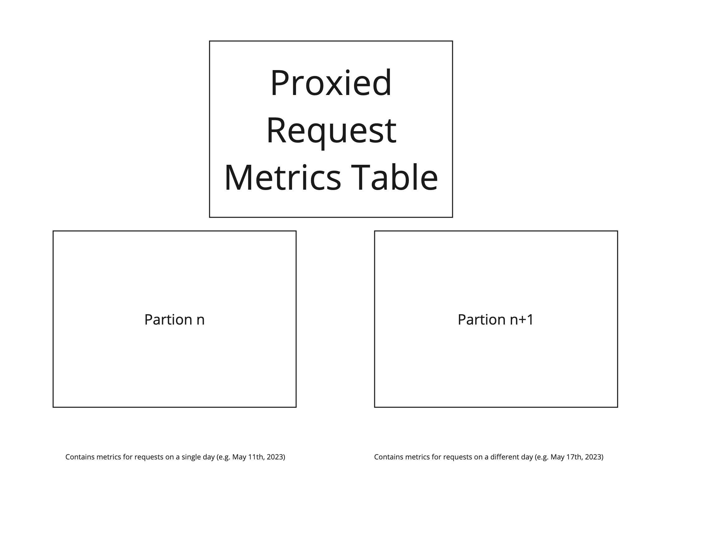
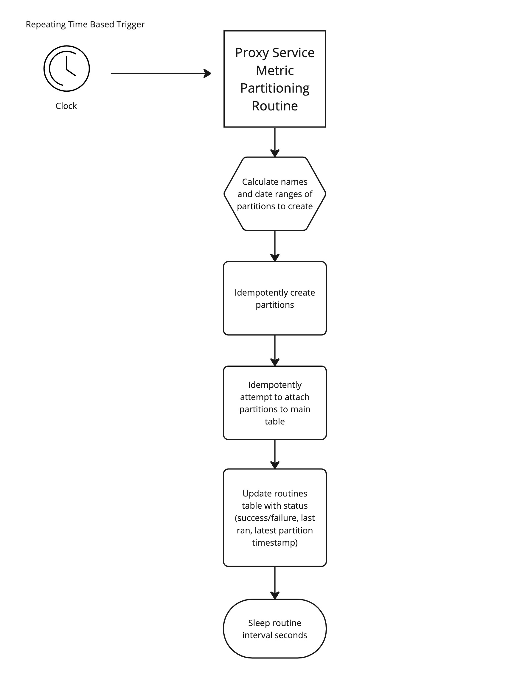

# Proxied Request Metrics Database Partitioning

Each request to a Kava Labs operated EVM API endpoint results in a new row created in the request metrics table. For mainnet there are currently ~20-30 million EVM requests daily.

For periods of a month or longer, this large amount of data with default Postgres settings is very slow to query and work over, which is a performance bottleneck for both the daily [metric compaction routines](./METRIC_COMPACTION_ROUTINE.md) and [ad hoc queries](https://kava-labs.atlassian.net/wiki/spaces/ENG/pages/1242398721/Useful+Analytic+Queries) made by empowered operators for analytical and operational purposes.

Thankfully, we can leverage [Postgres partitioning features](https://www.postgresql.org/docs/15/ddl-partitioning.html) to optimize for the above two use cases.
> Partitioning refers to splitting what is logically one large table into smaller physical pieces. Partitioning can provide several benefits:

> Query performance can be improved dramatically in certain situations, particularly when most of the heavily accessed rows of the table are in a single partition or a small number of partitions. Partitioning effectively substitutes for the upper tree levels of indexes, making it more likely that the heavily-used parts of the indexes fit in memory.

> When queries or updates access a large percentage of a single partition, performance can be improved by using a sequential scan of that partition instead of using an index, which would require random-access reads scattered across the whole table.

# Proxied Request Metrics Table Partitioning Strategy

The data access pattern for the daily metric compaction routines and ad hoc analytical queries is / can be composed of looking at proxied requests that occur with a 24 hour period, e.g.

1. an on-call engineer who wants to know the distribution of requests by IP address over the last 4 hours
1. metric compaction routines that calculate the daily min, max, average, p50,p90, and p99 request latencies for each API method
1. marketing and product owners who want to know the usage of a set of APIs ver a 3 month period (which can be calculated by concurrently querying for and then serially roll up those totals on a per day basis)

As such, for the `proxied_request_metrics` table, partitions are created spanning a single day of data (with the exception of the initial partition for data created before partitioning was implemented), and using the `request_time` timestamp value as the range key

as shown conceptually below



or concretely from the perspective of the database

```text
# connect to database locally
$ make reset ready debug-database

postgres=# \d+ proxied_request_metrics;
 Partitioned table "public.proxied_request_metrics"
...omitted schema...
 Partition key: RANGE (request_time)
 Indexes:
    "block_number_idx" btree (block_number)
    "hostname_idx" btree (hostname)
    "id_idx" btree (id)
    "method_name_idx" btree (method_name)
    "request_time_idx" btree (request_time)
 Partitions: proxied_request_metrics_year2023month1_day1 FOR VALUES FROM ('2023-01-01 00:00:00') TO ('2023-05-04 00:00:00'),
            proxied_request_metrics_year2023month5_day10 FOR VALUES FROM ('2023-05-10 00:00:00') TO ('2023-05-11 00:00:00'),
            proxied_request_metrics_year2023month5_day11 FOR VALUES FROM ('2023-05-11 00:00:00') TO ('2023-05-12 00:00:00'),
...moar partitions...
```

# Partitioning Routines

Partitions are great, but partitioning requires continuous maintenance.

From the [Postgres docs](https://www.postgresql.org/docs/current/ddl-partitioning.html)

```text
Inserting data into the parent table that does not map to one of the existing partitions will cause an error; an appropriate partition must be added manually.
```

While partitions can be created in an ad-hoc manual process (e.g. connecting to the database directly and running the below SQL statements to create and add a partition for request metrics captured on 6/1/2023)

```sql
CREATE TABLE IF NOT EXISTS proxied_request_metrics_year2023month6_day01
    (LIKE proxied_request_metrics INCLUDING DEFAULTS INCLUDING CONSTRAINTS);
ALTER TABLE proxied_request_metrics ATTACH PARTITION proxied_request_metrics_year2023month6_day01
    FOR VALUES FROM ('2023-06-01 00:0:0.0') TO ('2023-06-02 00:0:0.0');
```

this is [toil](https://sre.google/sre-book/eliminating-toil/) better handled by background routines that run on a continuous interval (defined by the value of `METRIC_PARTITION_ROUTINE_INTERVAL_SECONDS`) to create partitions up to `METRIC_PARTITION_PREFILL_PERIOD_DAYS` days in advance (inclusive of the current day on each run of said routine). At most 28 days of partitions can be pre-filled to guarantee constraint that metric partitioning routine never needs to create partitions spanning more than 2 calendar months.



Note that we create the partitions as separate tables and then attach versus directly creating as a partition of the main table in order to avoid locking the entire table when attaching the partition. Instead only the rows which belong to the partition itself will be locked during the time it takes to attach.

Note that while the [Postgres docs](https://www.postgresql.org/docs/current/ddl-partitioning.html) mention:

> Before running the ATTACH PARTITION command, it is recommended to create a CHECK constraint on the table to be attached that matches the expected partition constraint, as illustrated above. That way, the system will be able to skip the scan which is otherwise needed to validate the implicit partition constraint. Without the CHECK constraint, the table will be scanned to validate the partition constraint while holding an ACCESS EXCLUSIVE lock on that partition. It is recommended to drop the now-redundant CHECK constraint after the ATTACH PARTITION is complete. If the table being attached is itself a partitioned table, then each of its sub-partitions will be recursively locked and scanned until either a suitable CHECK constraint is encountered or the leaf partitions are reached.

we don't add check constraints because the partitions are created ahead of time, meaning they will be empty when attached to the main table, and as a result any indexing / check constraint overhead on the partition itself should be minimal.

## Monitoring Status of Partitioning

*Coming Soon*

`/status/database`

ops, ci and local tests need partitions for the current week and to be able to query the status of those processes for

https://service.public.testnet.proxy.kava.io/status/database

`/status/database`

```json
{
    "latest_proxied_request_metric_partition_table_name":"proxied_request_metrics_year_2023_month_6_day_11",
    "total_proxied_request_metric_partitions":40
}
```
