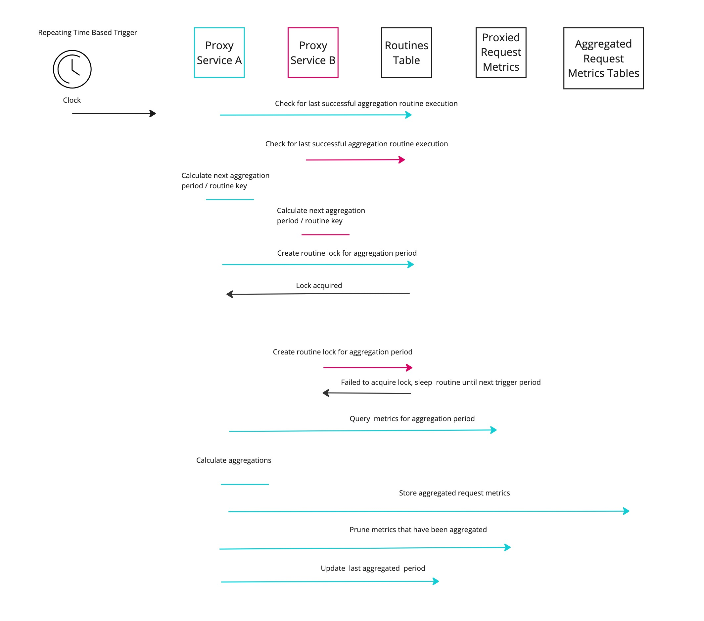

# Metric Compaction Routines

In order to keep the size and cost of the `proxied_request_metrics` table from growing infinitely, and to provide useful aggregated metrics for endpoint operators to analyze traffic patterns, the proxy service runs several processes to routinely compact that table



## Metric Pruning Routine

The Metric Pruning routine is responsible for deleting any metrics that are older than `N` specified days from the `proxied_request_metrics` table. It is controlled via the following environment variables

```bash
# Whether metric pruning routines should run on the configured interval, defaults to true
METRIC_PRUNING_ENABLED=true
# How frequently metric pruning routines should run
# defaults to 1 day
METRIC_PRUNING_ROUTINE_INTERVAL_SECONDS=10
# how long (after the proxy service starts) it will wait
# to run the first iteration of the metric pruning routine
METRIC_PRUNING_ROUTINE_DELAY_FIRST_RUN_SECONDS=5
# The maximum number of days of request metrics
# that should be preserved measured
# from the time the pruning routine runs
# all metrics for earlier days will be truncated
METRIC_PRUNING_MAX_REQUEST_METRICS_HISTORY_DAYS=45
```

## Metric Aggregation Routine

`#TODO`
