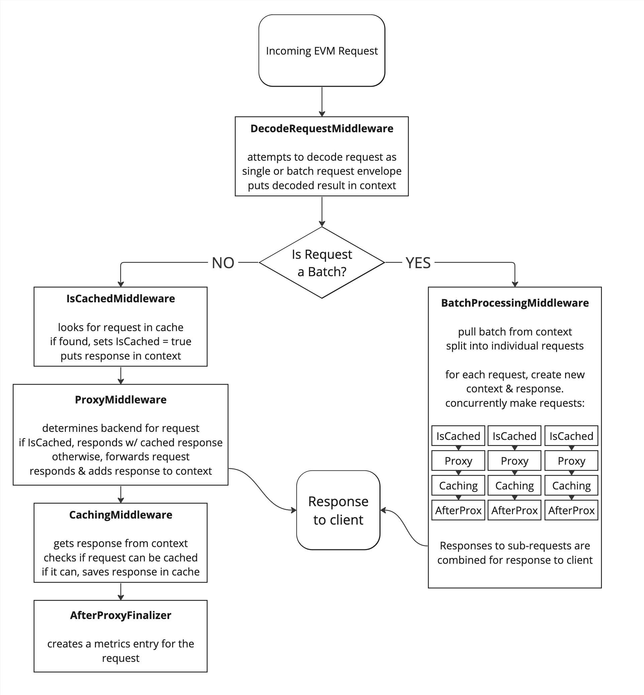

# Service Middleware

The proxy service uses a composable stack of middleware functions where each middleware is responsible for a focused sub-set of those features.

## Abstract Middleware

Middleware take the form of a function that accepts as params the `next` middleware function to call, and other parameters such as a logger or database client for debugging and storing request and response values.

```golang
func noOpMiddleware(next http.HandlerFunc, otherParams ...interface{}) http.HandlerFunc {
    return func(w http.ResponseWriter, r *http.Request) {
        next.ServeHTTP(w, r)
    }
}
```

Any modifications that the middleware function makes to the request or response before calling `next.ServeHTTP()` will be observable by the `next` middleware function, any modifications made after `next.ServeHTTP()` has been called will not.

## Execution order

The earlier the middleware is instantiated, the later it will run. For example the first middleware created by the proxy service is the middleware that will run after the request has been logged and proxied, thereby allowing it to access both the recorded request body and response body, and any context enrichment added by prior middleware.

https://github.com/Kava-Labs/kava-proxy-service/blob/847d7889bf5f37770d373d73cd4600a769ebd29c/service/service.go#L54-L110

## Middleware

The middleware sequence of EVM requests to the proxy service:


### Decode Request Middleware

1. Captures start time of request for latency metrics calculations
1. Attempts to decode the request:
   * As a single EVM request. If successful, forwards to Single Request Middleware Sequence with the request in the context.
   * As a batch EVM request. If successful, forwards to Batch Processing Middleware with batch in context.
   * On failure to decode, the request is sent down the Single Request Middleware Sequence, but with nothing in the context.

### Single Request Middleware Sequence
If a single request is decoded (as opposed to a batch list), or the request fails to decode, it is forwarded down this middleware sequence. Additionally, each individual sub-request of a batch is routed through this sequence in order to leverage caching and metrics collection.

This middleware sequence uses the decoded single request from the request context.

#### IsCached Middleware
The front part of the two-part caching middleware. Responsible for determining if an incoming request can be fielded from the cache. If it can, the cached response is put into the context.

See [CACHING](./CACHING.md#iscachedmiddleware) for more details.

#### Proxy Middleware

1. Proxies the request to the configured backend origin server.
2. Times the roundtrip latency for the response from the backend origin server and stores the latency in the context key `X-KAVA-PROXY-ORIGIN-ROUNDTRIP-LATENCY-MILLISECONDS` for use by other middleware.

The Proxy middleware is responsible for writing the response to the requestor. Subsequent middlewares are non-blocking to the response.

See [Proxy Routing](./PROXY_ROUTING.md) for details on configuration and how requests are routed.

#### Caching Middleware
Handles determining if a response can be put in the cache if it isn't already.

See [CACHING](./CACHING.md#cachingmiddleware) for more details.

#### After Proxy Middleware

1. Parses the request body and latency from context key values and creates a request metric for the proxied request.

### Batch Processing Middleware
1. Pulls decoded batch out of the request context
2. Separates into individual sub-requests
3. Routes each sub-request through the Single Request Middleware Sequence in order to leverage caching and metrics creation.
4. Combines all sub-request responses into a single response to the client.
