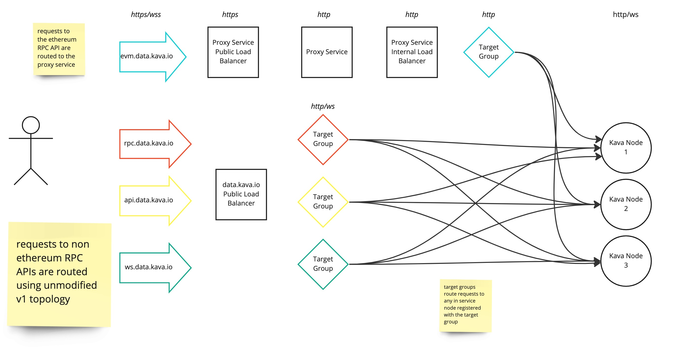
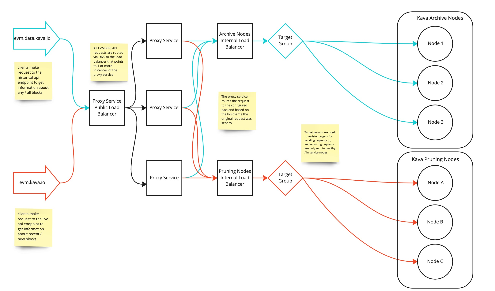

# Proxy Service AWS Network Topology Worked Example

This document provides a real world example of the network components and workflows involved with using the proxy service to proxy requests to one or more endpoints to one or more backend Kava EVM RPC API servers within an AWS environment.

## Networking Components

### Domain Name Service (DNS)

DNS is used to provide a fixed and public endpoint for apps and clients to use when communicating with the API(s) proxied by the proxy service. For example on kava mainnet, evm.kava.io is the DNS named used by clients that want to query EVM blocks or make transactions on the Kava EVM chain.

### Proxy Service Application Load Balancer

A public AWS Application Load Balancer is used to route requests to one or more instances of the proxy service. The public DNS for the endpoint (e.g. evm.kava.io) is mapped to this load balancer, ensuring that all requests meant for the endpoint are proxied by the proxy service.

### Kava Node Application Load Balancer(s)

A private (or public) AWS Application Load Balancer is used to route requests from the proxy service to Kava API nodes that can handle the request. Only nodes that are considered healthy by the target group are eligible for receiving a request.

Either separate load balancers, or a single load balancer with target group routing based on hostname can be used to route requests to the correct node type (e.g. sending requests for historical block data to archive nodes).

### Target Groups

AWS target groups are used to register and monitor the list of available and healthy Kava API nodes for serving a request.

## Workflows

### Single Host Proxy

In the case of deploying the proxy service in front of a single endpoint (in this case the historical/archive version of the mainnet Kava EVM RPC API)
- DNS is set up to route any requests from evm.data.kava.io to the proxy service load balancer over HTTPS
- The proxy service load balancer routes requests to an instance of the proxy service over HTTPS
- The proxy service proxies any requests it receives to the load balancer that fronts the cluster of Kava API archive nodes
- Requests to endpoints that are not proxied by the proxy service (e.g. api.kava.io) are routed to a different load balancer with separate target groups that route requests based on the hostname of the request
- Note that while all nodes in this example are able to serve requests from any of the public API endpoints, separate target groups and clusters of nodes can be created to differentially scale more nodes for specific API endpoints as needed - e.g. to prevent a surge in requests for one API endpoint exhausting the backend API node's capacity for handling requests to other endpoints.

### Multiple Host Proxy

When using the proxy service to proxy requests to multiple endpoints, the overall network topology is the same as for the single host workflow. The key difference is there are N number of internal load balancers / target groups for each (n) host that is being proxied.
