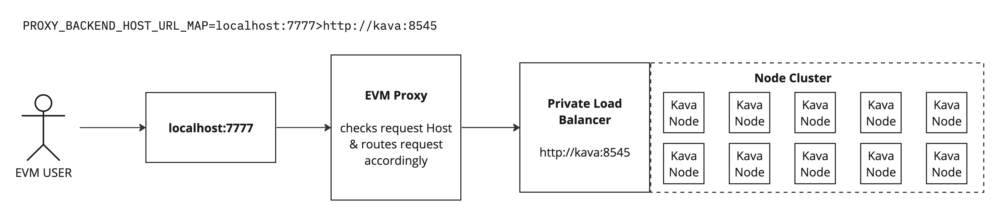
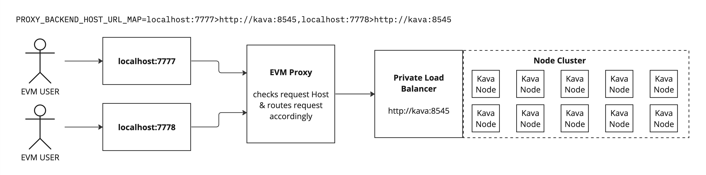
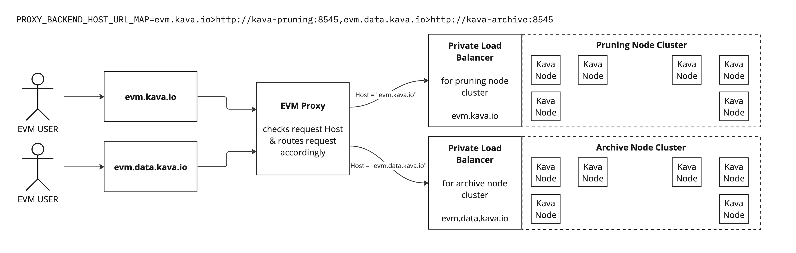
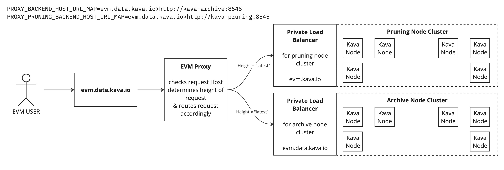
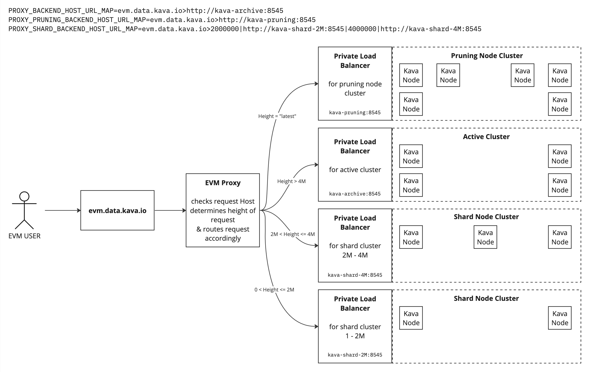

# Proxy Routing

The proxy chooses where to route a request primarily by the incoming Host URL to which the client
originally made their request. The routing is configured by maps of the Host to a backend url in
the environment variables.

All possible configurations use the `PROXY_BACKEND_HOST_URL_MAP` environment variable. This encodes
the default backend to route all requests from a given host. Additional functionality is available
via the `PROXY_HEIGHT_BASED_ROUTING_ENABLED` env variable (see [Rudimentary Sharding](#rudimentary-sharding)).

Consider the simplest case: a host-based-only routing proxy configured for one host
```
PROXY_HEIGHT_BASED_ROUTING_ENABLED=false
PROXY_BACKEND_HOST_URL_MAP=localhost:7777>http://kava:8545
```
This value is parsed into a map that looks like the following:
```
{
    "localhost:7777" => "http://kava:8545",
}
```
Any request to the service will be routed according to this map.
ie. all requests to local port 7777 get forwarded to `http://kava:8545`

Implementations of the [`Proxies` interface](../service/proxy.go#L13) contain logic for deciding
the backend host url to which a request is routed. This is used in the ProxyRequestMiddleware to
route requests.

Any request made to a host not in the map responds 502 Bad Gateway.

## More Examples of Host-only routing

Here is a diagram of the above network topology:



In this simple configuration of only having default hosts, you can do many things:

**Many hosts -> One backend**

```
PROXY_HEIGHT_BASED_ROUTING_ENABLED=false
PROXY_BACKEND_HOST_URL_MAP=localhost:7777>http://kava:8545,localhost:7778>http://kava:8545
```
This value is parsed into a map that looks like the following:
```
{
    "localhost:7777" => "http://kava:8545",
    "localhost:7778" => "http://kava:8545",
}
```
All requests to local ports 7777 & 7778 route to the same cluster at kava:8545



**Many hosts -> Many backends**

```
PROXY_HEIGHT_BASED_ROUTING_ENABLED=false
PROXY_BACKEND_HOST_URL_MAP=evm.kava.io>http://kava-pruning:8545,evm.data.kava.io>http://kava-archive:8545
```
This value is parsed into a map that looks like the following:
```
{
    "evm.kava.io"      => "http://kava-pruning:8545",
    "evm.data.kava.io" => "http://kava-archive:8545",
}
```
Requests made to evm.kava.io route to a pruning cluster.
Those made to evm.data.kava.io route to an archive cluster.



## Rudimentary Sharding

Now suppose you want multiple backends for the same host.

The proxy service supports height-based routing to direct requests that only require the most recent
block to a different cluster.
This support is handled via the [`PruningOrDefaultProxies` implementation](../service/shard.go#L17).

This is configured via the `PROXY_HEIGHT_BASED_ROUTING_ENABLED` and `PROXY_PRUNING_BACKEND_HOST_URL_MAP`
environment variables.
* `PROXY_HEIGHT_BASED_ROUTING_ENABLED` - flag to toggle this functionality
* `PROXY_PRUNING_BACKEND_HOST_URL_MAP` - like `PROXY_BACKEND_HOST_URL_MAP`, but only used for JSON-RPC
  requests that target the latest block (or are stateless, like `eth_chainId`, `eth_coinbase`, etc).

For example, to lighten the load for your resource-intensive (& expensive) archive cluster, you can
route all requests for the "latest" block to a less resource-intensive (& cheaper) pruning cluster:
```
PROXY_HEIGHT_BASED_ROUTING_ENABLED=true
PROXY_BACKEND_HOST_URL_MAP=evm.data.kava.io>http://kava-archive:8545
PROXY_PRUNING_BACKEND_HOST_URL_MAP=evm.data.kava.io>http://kava-pruning:8545
```
This value is parsed into a map that looks like the following:
```
{
  "default": {
    "evm.data.kava.io" => "http://kava-archive:8545",
  },
  "pruning": {
    "evm.data.kava.io" => "http://kava-pruning:8545",
  }
}
```
All traffic to evm.data.kava.io that targets the latest block (or requires no history) routes to the pruning cluster.
Otherwise, all traffic is sent to the archive cluster.



### Default vs Pruning Backend Routing

When `PROXY_HEIGHT_BASED_ROUTING_ENABLED` is `true`, the following cases will cause requests to route
to the the backend url defined in `PROXY_PRUNING_BACKEND_HOST_URL_MAP` (if present):
* requests that include any of the following block tags:
  * `"latest"`
  * `"finalized"`
  * `"pending"`
  * `"safe"`
  * empty/missing block tag (interpreted as `"latest"`)
* requests for methods that require no historic state, including transaction broadcasting
  * for a full list of methods, see [`NoHistoryMethods`](../decode/evm_rpc.go#L89)

All other requests fallback to the default backend url defined in `PROXY_BACKEND_HOST_URL_MAP`.
This includes
* requests for hosts not included in `PROXY_PRUNING_BACKEND_HOST_URL_MAP`
* requests targeting any specific height by number
  * NOTE: the service does not track the current height of the chain. if the tip of the chain is at
    block 1000, a query for block 1000 will still route to the default (not pruning) backend
* requests for methods that use block hash, like `eth_getBlockByHash`
* requests with unparsable (invalid) block numbers
* requests for block tag `"earliest"`

The service will panic on startup if a host in `PROXY_PRUNING_BACKEND_HOST_URL_MAP` is not present
in `PROXY_BACKEND_HOST_URL_MAP`.

Any request made to a host not in the `PROXY_BACKEND_HOST_URL_MAP` map responds 502 Bad Gateway.

## Sharding

Taking the example one step further, support the backend consists of data shards each containing a set of blocks. Although sharded routing can be configured without pruning vs default cluster routing, this example assumes it is.

The above example supports fielding requests to a particular endpoint with pruning & archive clusters:
* request for tip-of-chain -> pruning cluster
* everything else -> archive cluster ("default")

The proxy service supports breaking down "everything else" further by defining "shards": clusters that contain a fixed set of block heights.

This is configured via the `PROXY_SHARDED_ROUTING_ENABLED` and `PROXY_SHARD_BACKEND_HOST_URL_MAP` environment variables:
* `PROXY_SHARDED_ROUTING_ENABLED` - flag to toggle this functionality
* `PROXY_SHARD_BACKEND_HOST_URL_MAP` - encodes the shard cluster urls and block ranges for a given endpoint.
This support is handled via the [`ShardProxies` implementation](../service/shard.go#L103).


The map is encoded as follows:
```
PROXY_SHARDED_ROUTING_ENABLED=true
PROXY_SHARD_BACKEND_HOST_URL_MAP=HOST_A>ENDBLOCK_A1|ROUTE_A1|ENDBLOCK_A2|ROUTE_A2,HOST_B>ENDBLOCK_B1|ROUTE_B1
```

This defines two shards for `HOST_A` and one shard for `HOST_B`:
* `HOST_A`'s shards:
  * blocks 1 to `ENDBLOCK_A1` hosted at `ROUTE_A1`
  * blocks `ENDBLOCK_A1`+1 to `ENDBLOCK_A2` hosted at `ROUTE_A2`
* `HOST_B`'s shard:
  * blocks 1 to `ENDBLOCK_B1` hosted at `ROUTE_B1`

Shards are inclusive of their end blocks and they must collectively contain all data from block 1 to the end bock of the last shard.

Shards field requests that would route to the "Default" cluster in any of the above configurations:
* requests for `"earliest"` block are routed to the first defined shard
* any request for a specific height that is contained in a shard is routed to that shard.

All other requests continue to route to the default cluster. In this context, the default cluster is referred to as the "active" cluster (see below).

Requests for tx hashes or block hashes are routed to the "active" cluster.

### Shard Routing

When `PROXY_SHARDED_ROUTING_ENABLED` is `true`, "everything else" can be broken down further into clusters that contain fixed ranges of blocks.

As an example, consider a setup that has the following clusters:
* Pruning cluster (`http://kava-pruning:8545`)
* "Active" cluster - blocks 4,000,001 to chain tip (`http://kava-archive:8545`)
* Shard 2 - blocks 2,000,001 to 4,000,000 (`http://kava-shard-4M:8545`)
* Shard 1 - blocks 1 to 2,000,000 (`http://kava-shard-2M:8545`)

The proxy service can be configured to as follows:
```
PROXY_HEIGHT_BASED_ROUTING_ENABLED=true
PROXY_SHARDED_ROUTING_ENABLED=true
PROXY_BACKEND_HOST_URL_MAP=evm.data.kava.io>http://kava-archive:8545
PROXY_PRUNING_BACKEND_HOST_URL_MAP=evm.data.kava.io>http://kava-pruning:8545
PROXY_SHARD_BACKEND_HOST_URL_MAP=evm.data.kava.io>2000000|http://kava-shard-2M:8545|4000000|http://kava-shard-4M:8545
```

This value is parsed into a map that looks like the following:
```
{
  "default": {
    "evm.data.kava.io" => "http://kava-archive:8545",
  },
  "pruning": {
    "evm.data.kava.io" => "http://kava-pruning:8545",
  },
  "shards": {
    2000000 => "http://kava-shard-2M:8545",
    4000000 => "http://kava-shard-4M:8545"
  }
}
```

All requests that would route to the "default" cluster in teh "Default vs Pruning Backend Routing" example route as follows:
* requests for specific height between 1 and 2M -> `http://kava-shard-2M:8545`
  * this includes requests for `"earliest"`
* requests for specific height between 2M+1 and 4M -> `http://kava-shard-4M:8545`
* requests for a block hash or tx hash -> the active cluster: `http://kava-archive:8545`.

Otherwise, requests are routed as they are in the "Default vs Pruning Backend Routing" example.



### "Active" Cluster

In practice, a full-archive node can be used as the active cluster. However, the data can be slimmed down by accounting for the fact that it doesn't need the application data for blocks contained in the shards.

The optimally-sized active cluster runs on a unique data set that includes:
* At least one recent block - this will be the starting point for the node to begin syncing once spun up. Ideally, this is the last shard's end block + 1.
* A complete blockstore, cometbft state, and tx_index

The blockstore, cometbft state, and tx_index are required for fielding requests for data on unknown heights. These are requests for block hashes and transaction hashes. Because the proxy service can't know which height a particular hash is for (and therefore, to which shard the request should be routed), these complete databases are required to handle requests for the hashes.

The optimally-sized node data can be created from a full-archive node by pruning only the application state for the node. On Kava, this can be accomplished with the `--only-app-state` flag of the shard command:
```
kava shard --start <last-shard-end-block-plus-1> --end -1 --only-appstate-
```

The bulk of data on cosmos-sdk chains like Kava is in the application.db, so pruning the blocks allow for a much smaller cluster footprint than a full archive node.

### Shard Clusters

On Kava, data for shards can be created with the `shard` command of the Kava CLI from any node that contains the desired shard block range:
```
kava shard --home ~/.kava --start <shard-start-block> --end <shard-end-block>
```

## Metrics

When metrics are enabled, the `proxied_request_metrics` table tracks the backend to which requests
are routed in the `response_backend` column.

When height-based sharding is disabled (`PROXY_HEIGHT_BASED_ROUTING_ENABLED=false`), the value is
always `DEFAULT`.

When enabled, the column will have one of the following values:
* `DEFAULT` - the request was routed to the backend defined in `PROXY_BACKEND_HOST_URL_MAP`
* `PRUNING` - the request was routed to the backend defined in `PROXY_PRUNING_BACKEND_HOST_URL_MAP`
* `SHARD` - the request was routed to a shard defined in the `PROXY_SHARD_BACKEND_HOST_URL_MAP`

Additionally, the actual URL to which the request is routed to is tracked in the
`response_backend_route` column.
